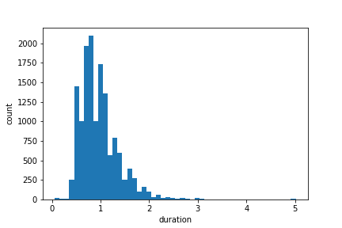
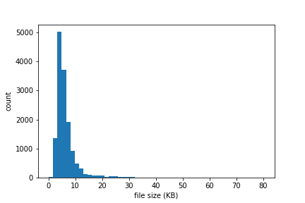

# Devanagari Characters

Devanagari Characters speech pronunciation dataset.
This dataset was collected from [Teach Me Nepali](https://script.google.com/macros/s/AKfycbyCsBU7Nsi6a2aYUWJOiknolUeWg1NDA49gaavrp9uMrzyyo4E/exec) webapp. Go to the [link](https://script.google.com/macros/s/AKfycbyCsBU7Nsi6a2aYUWJOiknolUeWg1NDA49gaavrp9uMrzyyo4E/exec) to contribute your pronunciation/voice recording to the dataset.

This dataset contains 14,452 data samples corresponding to 444 classes. The labels mapping to the actual characters is in the [label_to_character.csv](./label_to_character.csv) file.

```python
### dictionary of characters
dict_1 = { 'a':'अ', 'aa':'आ', 'i':'इ', 'ii':'ई', 'u':'उ', 'uu':'ऊ', 'e':'ए', 'ai':'ऐ', 'o':'ओ', 'au':'औ', 'am':'अं', 'ah':'अः' }
dict_2 = { 'aa':'ा', 'i':'ि', 'ii':'ी', 'u':'ु', 'uu':'ू', 'e':'े', 'ai':'ै', 'o':'ो', 'au':'ौ', 'am':'ं', 'ah':'ः' }
dict_3 = { 'ka':'क', 'kha':'ख', 'ga':'ग', 'gha':'घ', 'nga':'ङ',
           'cha':'च', 'chha':'छ', 'ja':'ज', 'jha':'झ', 'yan':'ञ', 
           'toa':'ट', 'thoa':'ठ', 'doa':'ड', 'dhoa':'ढ', 'ndoa':'ण', 
           'ta':'त', 'tha':'थ', 'da':'द', 'dha':'ध', 'na':'न', 
           'pa':'प', 'fa':'फ', 'ba':'ब', 'bha':'भ', 'ma':'म', 
           'ya':'य', 'ra':'र', 'la':'ल', 'wa':'व', 
           'sa':'ष', 'sha':'स', 'shaa':'श', 'ha':'ह', 
           'chya':'क्ष', 'tra':'त्र', 'gya':'ज्ञ' }
```

## Thanks
Thanks to all those who helped to collect this dataset. Without their contribution this dataset was not possible. [CREDITS](./credits.csv)

### Dataset Information

##### Histogram: Duration of audio recordings



##### Histogram: Size of files



 

